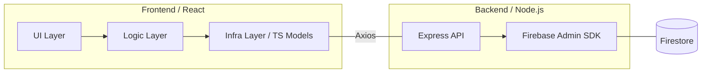

# Quiz App Fullstack (WIP)

## Roadmap / Todo

- [x] Backend API 基盤の構築 (Express)
- [x] 履歴データの移行と降順ソートの実装
- [/] TypeScript への完全移行(進行中：モデル・サーバー層完了)
- [ ] クイズ生成ロジックのサーバーサイド移管
- [ ] 認証フロー（Auth Guard）のサーバーサイド統合

Firebase を活用したクイズアプリをベースに、自律的なバックエンド（Node.js / Express）への移行とフルスタック化を目指す開発プロジェクトです。

## 概要

本プロジェクトは、フロントエンド完結型の構成から、スケーラビリティと保守性を追求したフルスタック・アーキテクチャへの移行を目的としています。

※ 詳細は各ディレクトリの README を参照してください。

- **ベースプロジェクト (Frontend v1.0.0)**: [https://github.com/MasatakeI/quiz_app](https://github.com/MasatakeI/quiz_app)
- **現在のステータス**:
  - **フロントエンド**: Firebase SDK 依存からの脱却 / 4層レイヤードアーキテクチャの導入完了
  - **バックエンド**: Node.js (Express) による API 基盤およびデータ永続化層の構築完了
  - **型安全性**: TypeScript 導入によるエンドツーエンドの型保証を推進中

## クイックスタート (Quick Start)

ルートディレクトリで以下のコマンドを実行するだけで、フロントエンドとバックエンドが同時に起動します。

```bash
npm install
npm run dev
```

## アーキテクチャの設計思想

長期的な運用と技術スタックの変更に耐えうる設計にするため、**「関心の分離 (SoC)」** を徹底しています。



### 1. Layered Architecture (Frontend)

UI / Hooks / Redux / Model(Infra) の 4 層に分離。インフラ（Axios / Firebase）の変更が UI 層に影響を与えない疎結合な設計を採用しています。

### 2. Backend Decoupling

Firebase SDK に直接依存せず、自作 API を仲介させることでビジネスロジックをサーバー側に集約。将来的なデータベース（PostgreSQL等）へのリプレイスコストを最小限に抑えています。

### 3. Domain Error Mapping

インフラ固有のエラー（HTTP ステータスコードや SDK 独自エラー）をアプリケーション共通の「ドメインエラー」に変換。プレゼンテーション層にインフラの詳細を漏洩させない、一貫したエラーハンドリングを実現しています。

## 技術スタック

| Layer              | Technology                                  |
| :----------------- | :------------------------------------------ |
| **Frontend**       | React, Redux Toolkit, Tailwind CSS, Vitest  |
| **Backend**        | Node.js, Express, Firebase Admin SDK        |
| **Database**       | Firestore / PostgreSQL (Planned)            |
| **Infrastructure** | Vercel (Frontend), Railway/Render (Backend) |

## 📂 プロジェクト構造

各ディレクトリの詳細は、それぞれの直下にある `README.md` を参照してください。

```text
.
├── client/   # React Frontend (Layered Architecture implementation)
│   └── README.md
└── server/   # Node.js Backend (Express API & Firebase Admin SDK)
    └── README.md
```
