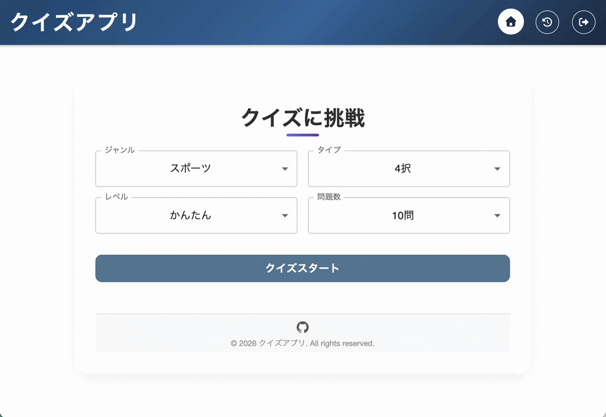
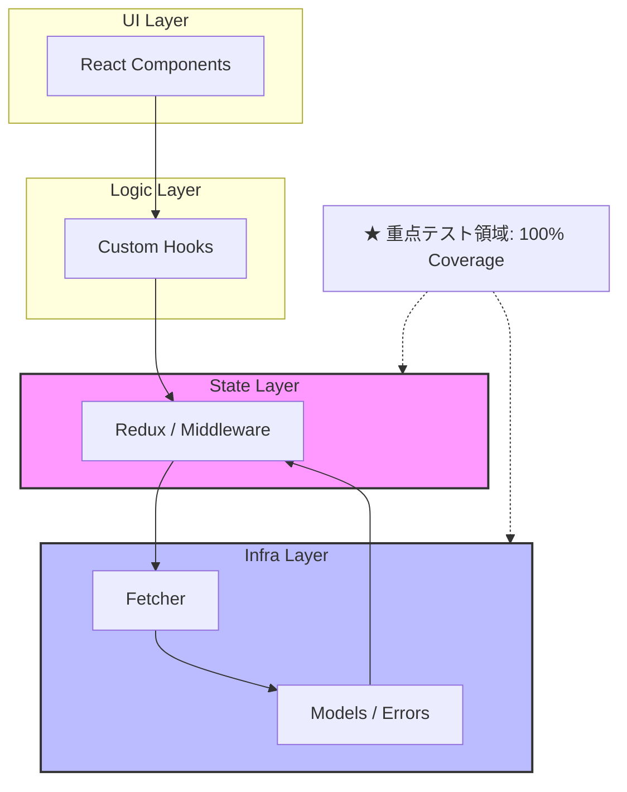
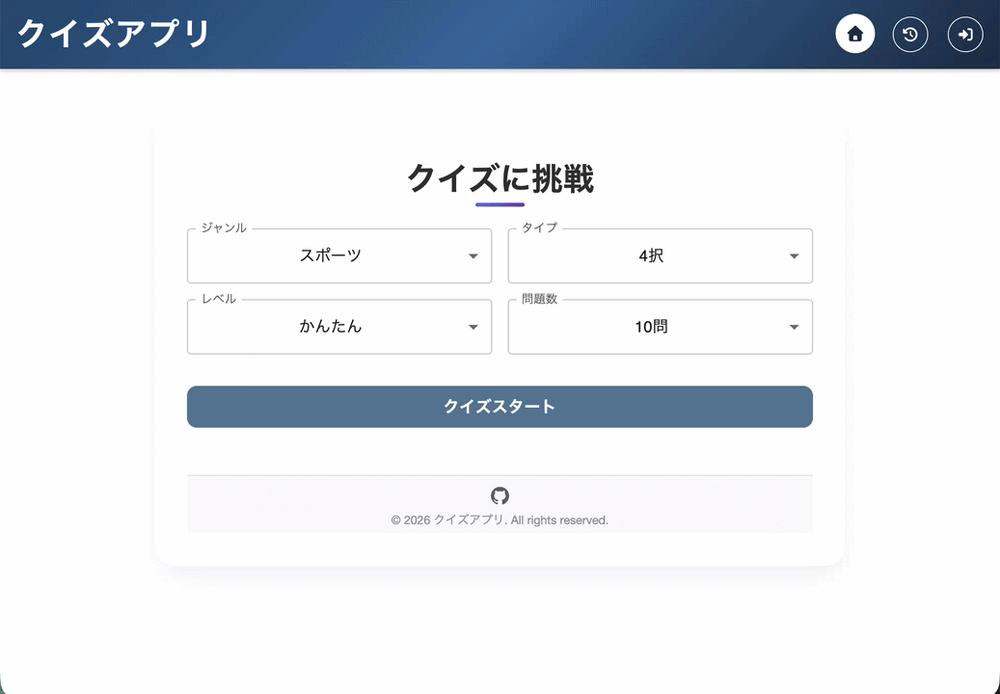
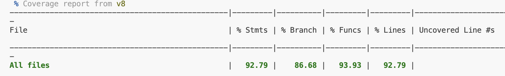
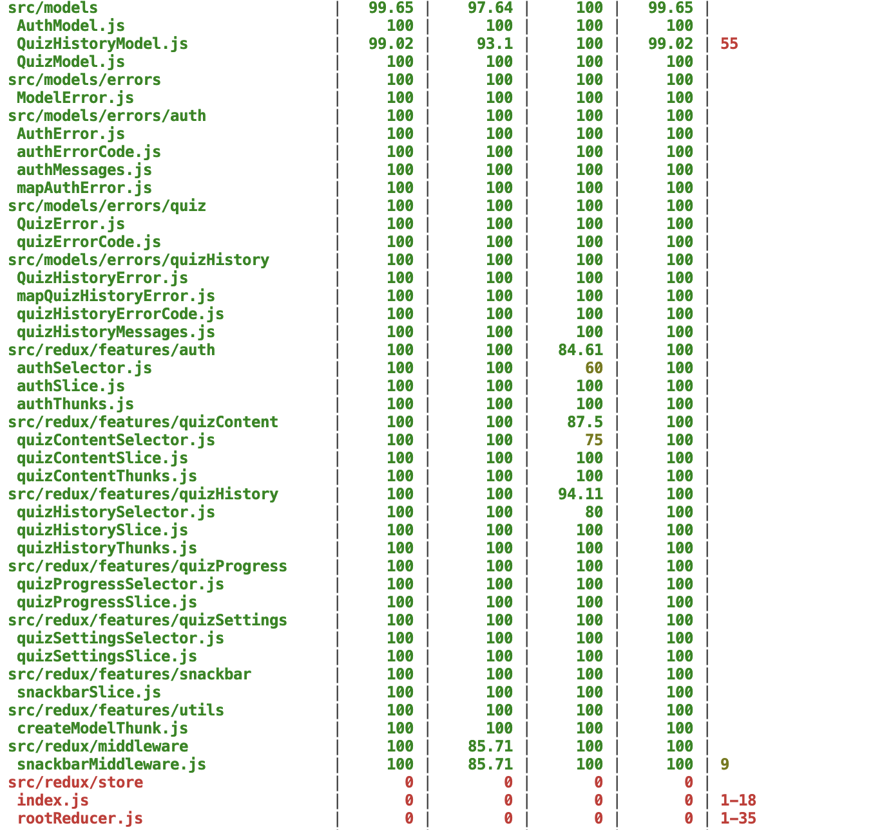
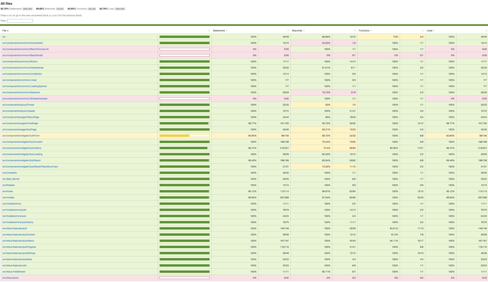

# クイズアプリ（React / Redux Toolkit / Firebase）

> **SPA (Single Page Application)**:
> GitHub Actionsによる自動テスト(Vitest)と、Vercelへの自動デプロイを統合。
> 高いテスタビリティと、Middlewareによる堅牢なエラーハンドリングを実現したモダンなSPA構成です。

## 概要

Open Trivia Database API を活用した、カスタマイズ性の高い 学習用 Web アプリケーション。
**「実務レベルのテスタビリティ」と「疎結合なアーキテクチャ」**の完遂をテーマとし、フロントエンドから BaaS 連携まで一貫した設計・実装を行いました。

- **ライブデモ**: [https://quiz-app-zeta-pearl.vercel.app/](https://quiz-app-zeta-pearl.vercel.app/)
- **開発環境**
  | Layer | Stack |
  | :--- | :--- |
  | **UI / Framework** | React 18 / Vite |
  | **State Management** | Redux Toolkit / Redux Thunk |
  | **BaaS / Database** | Firebase (Auth / Firestore) |
  | **Routing** | React Router 6 |
  | **Testing** | Vitest / React Testing Library |
  | **CI/CD / Hosting** | GitHub Actions / Vercel |

---

## アーキテクチャと設計思想

大規模開発への拡張を想定し、**関心の分離（Separation of Concerns）**を徹底した 4 層構造を採用しています。

---

## 技術的な選定理由とこだわり

### 宣言的ルーティングと認可制御

- `AppRoutes` に認可ロジック（Auth Guard）を独立
- コンポーネントが認証状態を意識しない疎結合な設計

---

### 抽象化されたエラーハンドリング

- `mapError` 変換層を設置
- Firebase 等の外部依存エラーを独自クラス `QuizHistoryError` へ変換
- UI 層に影響を与えない「変更に強い」設計

---

## 技術的な挑戦と課題解決（Selected Achievements）

### 1. リクエスト・ガードによる冪等性の確保

**【課題】**
通信遅延時の連打による二重投稿や、429 API Rate Limit エラーの発生。

**【解決策】**
Redux Toolkit の `condition` オプションを活用し
実行中ステータス（isLoading）に基づくリクエスト遮断ロジックを実装。

**【結果】**

- 不要な API コールを 100% 遮断
- サーバーリソース節約
- ユーザー操作に対する堅牢性向上

---

### 2. Firestore WriteBatch によるアトミックなデータ操作

**【課題】**
クイズ履歴の一括削除時におけるデータ不整合の懸念。

**【解決策】**

- Firestore の `WriteBatch` を採用しトランザクション性を確保\
- Redux による **楽観的更新（Optimistic Updates）** を併用

**【結果】**

- データ整合性を 100% 保証
- 通信待ち不要のスムーズな UX

---

### 3. Branch Coverage を重視した「センサー」としてのテスト戦略

**【課題】**
複雑な条件分岐（正解 / 不正解 / 未回答 / 例外）の品質担保。

**【解決策】**

- 分岐網羅（Branch Coverage）80%以上を目標設定
- テスト困難箇所を「設計の歪み」と定義しリファクタリング

**【結果】**

- 主要ロジックでカバレッジ 85〜100% 達成
- デグレード（先祖返り）ゼロ

## 4. Middlewareによる横断的なエラーハンドリングの自動化

**【課題】**
各コンポーネントやThunk内で個別にエラー通知（Snackbar）を呼び出すと、コードが重複し保守性が低下する。

**【解決策】**
Redux Middlewareを活用し、isRejectedWithValue なアクションを検知して自動的にSnackbarを表示する共通基盤を構築。

**【結果】**

UIコンポーネントから通知ロジックを完全に排除
全てのエラーに対して一貫したユーザー体験を保証
VitestによるMiddlewareの単体テストを実施し、Actionの検知ロジックの正確性を担保

### 5. SPAにおけるルーティングの整合性確保（Vercel デプロイ最適化）

**【課題】**
React Router を利用した SPA（Single Page Application）構成において、Vercel デプロイ後に特定のパス（例: `/history`）でブラウザをリロードすると、サーバー側に物理ファイルが存在しないため 404 エラーが発生する。

**【解決策】**
`vercel.json` を導入し、すべてのリクエストを `index.html` へ転送（Rewrite）する設定を適用。クライアントサイド・ルーティングとサーバーサイドの応答を同期させた。

**【結果】**

- どの画面でリロードを行っても正常にアプリが再開される堅牢性を確保
- ユーザー体験を損なわない、実務レベルのホスティング環境を構築

### 6. 環境変数による機密情報と環境の管理

**【課題】**
Firebase の API キーなどの構成情報をソースコードにハードコードすると、リポジトリ公開時の悪用リスクや、開発・本番環境の切り替えコストが発生する。

**【解決策】**
Vite の `import.meta.env` を活用し、機密情報を `.env` ファイルおよびホスティング先（Vercel）の環境変数へと完全移行。併せて、Firebase コンソール側でのリファラ制限を適用し、多層的な防御を構築。

**【結果】**

- GitHub 上での機密情報露出を完全に排除
- 開発環境と本番環境をコードの書き換えなしでシームレスに切り替え可能
- 実務レベルのセキュリティ・プラクティスを遵守

---

## テスト・品質指標

| カテゴリ           | 対象範囲・内容                                          | 指標           |
| :----------------- | :------------------------------------------------------ | :------------- |
| **ユニットテスト** | Model（デコード / 正規化）, Redux（Selector / Reducer） | 100% Pass      |
| **統合テスト**     | Hooks（Dispatch連携）, UI（表示状態 / 遷移ガード）      | 85%〜 Branch   |
| **対象外**         | 静的レイアウト、単純なラッパー、Redux Store 設定        | 目視・静的解析 |
| **コード品質**     | ESLint / Prettier, he による XSS 対策                   | 常用           |

---

### テストカバレッジ詳細

「センサーとしてのテスト」を体現するため、ロジック層を中心に高い網羅率を維持しています。

| カテゴリ            | Stmts      | Branch     | Lines      | 備考                                       |
| :------------------ | :--------- | :--------- | :--------- | :----------------------------------------- |
| **All Files**       | **92.79%** | **86.71%** | **92.95%** | プロジェクト全体の品質指標                 |
| **Models / Errors** | **99.8%**  | **98.4%~** | **99.8%**  | データ変換・独自エラークラスの整合性を担保 |
| **Redux (Logic)**   | **100%~**  | **96.5%**  | **100%**   | 状態遷移、非同期Thunk、Middlewareの検証    |
| **Hooks / Utils**   | **99.1%**  | **96.8%**  | **99.1%**  | Dispatch連携やナビゲーションロジックの網羅 |
| **Pages / Widgets** | **95.2%**  | **78.5%**  | **95.2%**  | UIインタラクションと表示分岐のテスト       |

#### カバレッジに関する特記事項

- **Branch Coverageの重視**: 複雑なクイズ進行ロジックにおいて、全分岐パターンの検証を優先。
- **テスタビリティの追求**: `renderWithStore` や `renderHookWithStore` を自作し、Reduxと密結合したコンポーネントやHooksも結合テストレベルで網羅。
- **戦略的なテスト範囲の選定**: `ロジック層への集中`: バグが混入しやすく、ユーザー体験に直結する「状態遷移」や「データ変換」にテストリソースを集中させています。
  `非テスト対象の定義`: 視覚的確認が主となる Footer や Header などの静的レイアウト、およびロジックを持たない store/index.js 等の設定ファイルは、保守コストとリスクのバランスを考慮し、あえて自動テストの対象外としています。これらは将来的に必要に応じて E2E テスト等での補完を想定しています

### テストエビデンス

「壊れやすい箇所」を重点的にガードし、リファクタリングに強いコードベースを実現しています。

カバレッジレポート（ターミナル出力）を表示

#### 全体サマリー

> プロジェクト全体で 92% 超の網羅率を維持しています。
> 

#### レイヤ別詳細

> **Models / Redux / Middleware** 等のロジック層は 100% のカバレッジを達成。
> ※ Redux Store 設定等のボイラープレートは、リスクと保守コストを考慮し意図的に除外しています。

> 

HTMLレポートの詳細を表示

> **Note**: 主要なロジック層（Models / Redux / Hooks）で 100% の網羅率を達成。
> ブラウザでの視認性を高めたレポートです。各ファイルの分岐網羅（Branch）まで詳細に検証済みです。
> 静的コンポーネントや設定ファイル（Redux Store等）は、保守コストとリスクを考慮し、意図的に自動テストの対象外としています（ROIの最適化）。
> 

> ※ `vitest --coverage` による実行結果（2026年3月27日時点）

---

## プロジェクトを通じて得た知見

> テストを書くことは、単にバグを防ぐだけでなく
> **設計の不備を早期発見するための対話である**

テスタビリティを追求した結果
責務が適切に分散されたクリーンなアーキテクチャへと昇華

実務における「保守性の高いコード」への理解を深化

---

## 今後のロードマップ

- [x] GitHub Actionsによる自動テストのパイプライン構築
- [x] GitHub ActionsによるVercelへの自動デプロイ設定
- [ ] `React.lazy` / `Suspense` による Code Splitting
- [ ] Service Worker によるオフラインプレイ対応
- [ ] **Full-stack Migration**:
  - 現在の Firebase 構成から、自前バックエンド（Node.js / NestJS + PostgreSQL）への移行。
  - より複雑なクエリの最適化と、独自認証ロジックの構築に挑戦予定。
