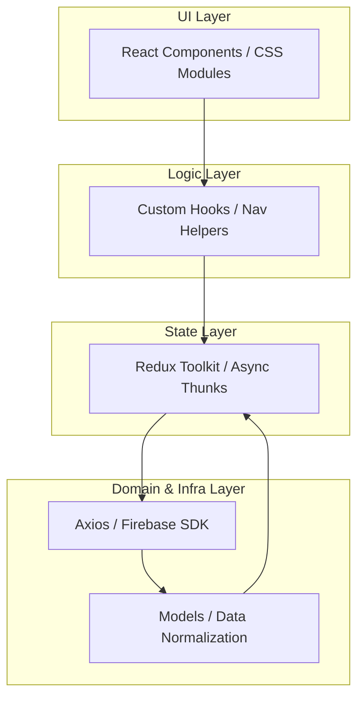
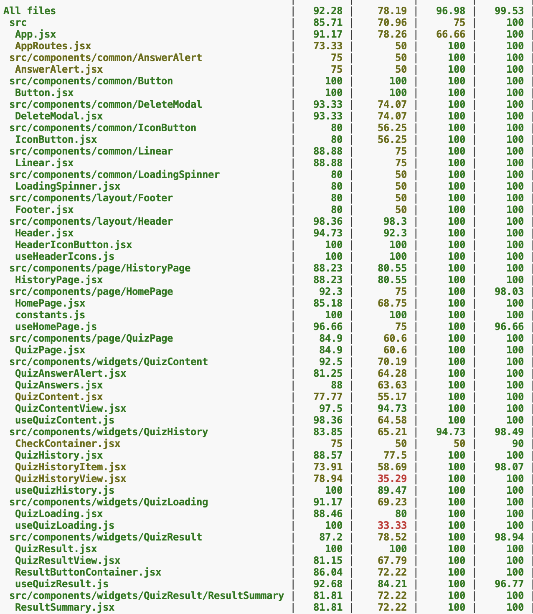
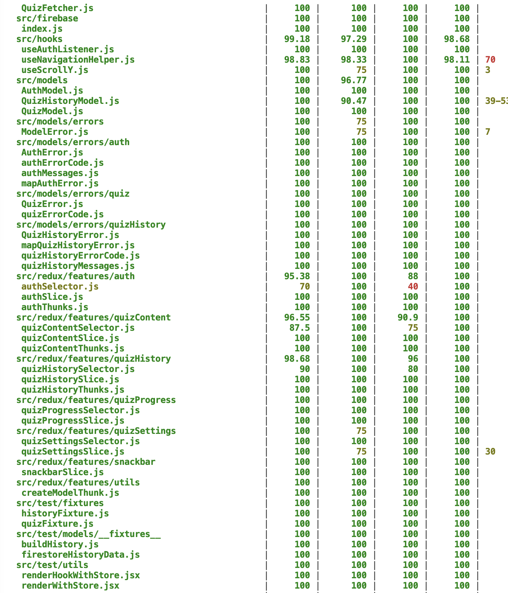

# クイズアプリ（React / Redux Toolkit / Firebase）


## 概要

Open Trivia Database API を活用した、カスタマイズ性の高い学習用 Web アプリケーション。
個人開発ながら、**「実務レベルのテスタビリティ」と「疎結合なアーキテクチャ」**の完遂をテーマとし、フロントエンドから BaaS 連携まで一貫した設計・実装を行いました。

- **ライブデモ**: [https://quiz-app-zeta-pearl.vercel.app/](https://quiz-app-zeta-pearl.vercel.app/)
- **開発環境**: React 18, Redux Toolkit, React Router 6, Firebase (Auth/Firestore), Vitest, React Testing Library

---

## アーキテクチャと設計思想

大規模開発への拡張を想定し、**関心の分離（Separation of Concerns）**を徹底した 4 層構造を採用しています。



---

## 技術的な選定理由とこだわり

### 宣言的ルーティングと認可制御

- `AppRoutes` に認可ロジック（Auth Guard）を独立\
- コンポーネントが認証状態を意識しない設計

---

### 抽象化されたエラーハンドリング

- `mapError` 変換層を設置\
- Firebase 等の外部依存エラーを独自クラス `QuizHistoryError` へ変換\
- UI 層に影響を与えない「変更に強い」設計

---

## 技術的な挑戦と課題解決（Selected Achievements）

### 1. リクエスト・ガードによる冪等性の確保

**【課題】**\
通信遅延時の連打による二重投稿や、429 API Rate Limit エラーの発生。

**【解決策】**\
Redux Toolkit の `condition` オプションを活用し、\
実行中ステータス（isLoading）に基づくリクエスト遮断ロジックを実装。

**【結果】**\

- 不要な API コールを 100% 遮断\
- サーバーリソース節約\
- ユーザー操作に対する堅牢性向上

---

### 2. Firestore WriteBatch によるアトミックなデータ操作

**【課題】**\
クイズ履歴の一括削除時におけるデータ不整合の懸念。

**【解決策】**\

- Firestore の `WriteBatch` を採用しトランザクション性を確保\
- Redux による **楽観的更新（Optimistic Updates）** を併用

**【結果】**\

- データ整合性を 100% 保証\
- 通信待ち不要のスムーズな UX

---

### 3. Branch Coverage を重視した「センサー」としてのテスト戦略

**【課題】**\
複雑な条件分岐（正解 / 不正解 / 未回答 / 例外）の品質担保。

**【解決策】**\

- 分岐網羅（Branch Coverage）80%以上を目標設定\
- テスト困難箇所を「設計の歪み」と定義しリファクタリング

**【結果】**\

- 主要ロジックでカバレッジ 85〜100% 達成\
- デグレード（先祖返り）ゼロ

---

## テスト・品質指標

カテゴリ 対象範囲・内容 指標

- **ユニットテスト** Model（デコード / 正規化）, 100% Pass
  Redux（Selector / Reducer）
- **統合テスト** Hooks（Dispatch連携）, UI（表示状態 85%〜 Branch
  / 遷移ガード）
- **コード品質** ESLint / Prettier による静的解析, 常用
  he による XSS 対策
- **継続的インテグレーション (CI)**: GitHub Actions を利用し、Push/PR ごとに自動テストとカバレッジ計測を実行。
- **カバレッジ目標**: 主要ロジック層において Branch Coverage 80% 以上を維持。

---

### テストカバレッジ詳細

「センサーとしてのテスト」を体現するため、ロジック層を中心に高い網羅率を維持しています。

| カテゴリ                  | Stmts      | Branch     | Lines      | 備考                                 |
| :------------------------ | :--------- | :--------- | :--------- | :----------------------------------- |
| **All Files**             | **92.28%** | **78.19%** | **99.53%** | プロジェクト全体の品質指標           |
| **Models / Errors**       | **100%**   | **90.4%~** | **100%**   | ビジネスロジック・型変換・エラー処理 |
| **Redux (Slices/Thunks)** | **95.3%~** | **100%**   | **100%**   | 状態遷移と非同期処理の堅牢性         |
| **Hooks / Utils**         | **99.1%**  | **97.2%**  | **98.6%**  | UIロジックの共通化と検証             |

#### カバレッジに関する特記事項

- **Branch Coverageの重視**: 複雑なクイズ進行ロジックにおいて、全分岐パターンの検証を優先。
- **テスタビリティの追求**: `renderWithStore` や `renderHookWithStore` を自作し、Reduxと密結合したコンポーネントやHooksも結合テストレベルで網羅。

### 🧪 テストエビデンス

<details>
<summary>カバレッジレポートのスクリーンショットを表示（クリックで展開）</summary>




</details>

> ※ `vitest --coverage` による実行結果（2026年3月時点）

---

## プロジェクトを通じて得た知見

> テストを書くことは、単にバグを防ぐだけでなく、\
> **設計の不備を早期発見するための対話である**

テスタビリティを追求した結果、\
責務が適切に分散されたクリーンなアーキテクチャへと昇華。

実務における「保守性の高いコード」への理解を深化。

---

## 今後のロードマップ

### CI/CD

- [x] CI/CDの導入（GitHub Actionsによる自動テスト）

### Performance

- []`React.lazy` / `Suspense` による Code Splitting

### PWA

- []Service Worker によるオフラインプレイ対応

```

```
